# ehtc-battle-center

<!-- Auto Generated Below -->

## Dependencies

### Depends on

- ion-card
- ion-card-header
- ion-toolbar
- ion-buttons
- ion-icon
- ion-title
- ion-card-content
- ion-grid
- ion-row
- ion-col
- ion-button
- ion-list
- ion-item
- ion-note
- ion-label
- ion-badge
- [ehtc-battle](../battle)

### Graph

```mermaid
graph TD;
  ehtc-battle-center --> ion-card
  ehtc-battle-center --> ion-card-header
  ehtc-battle-center --> ion-toolbar
  ehtc-battle-center --> ion-buttons
  ehtc-battle-center --> ion-icon
  ehtc-battle-center --> ion-title
  ehtc-battle-center --> ion-card-content
  ehtc-battle-center --> ion-grid
  ehtc-battle-center --> ion-row
  ehtc-battle-center --> ion-col
  ehtc-battle-center --> ion-button
  ehtc-battle-center --> ion-list
  ehtc-battle-center --> ion-item
  ehtc-battle-center --> ion-note
  ehtc-battle-center --> ion-label
  ehtc-battle-center --> ion-badge
  ehtc-battle-center --> ehtc-battle
  ion-card --> ion-ripple-effect
  ion-button --> ion-ripple-effect
  ion-item --> ion-icon
  ion-item --> ion-ripple-effect
  ehtc-battle --> ion-segment
  ehtc-battle --> ion-segment-button
  ehtc-battle --> ion-label
  ehtc-battle --> ion-list
  ehtc-battle --> ion-list-header
  ehtc-battle --> ion-item
  ehtc-battle --> ion-button
  ehtc-battle --> ion-note
  ehtc-battle --> ion-badge
  ehtc-battle --> ion-icon
  ion-segment-button --> ion-ripple-effect
  style ehtc-battle-center fill:#f9f,stroke:#333,stroke-width:4px
```

----------------------------------------------

*Built with [StencilJS](https://stenciljs.com/)*
